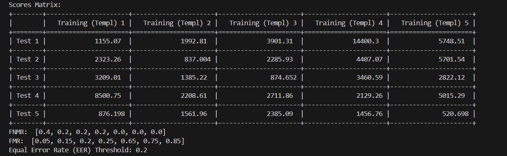
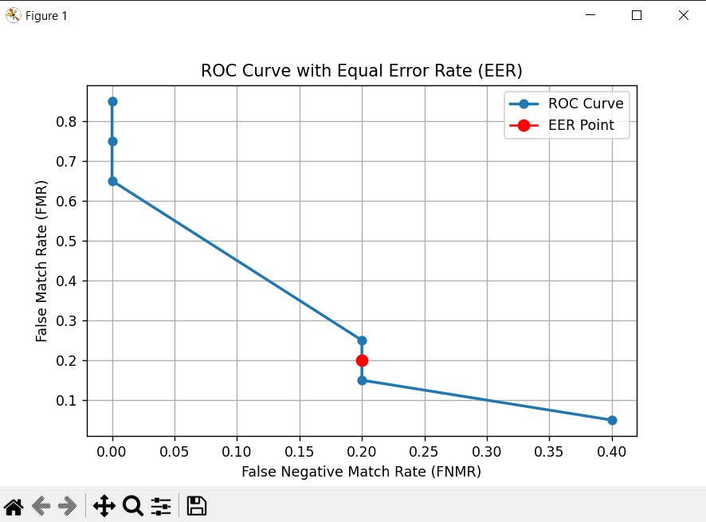

# Finger Print Recognition

## Description:

The biometric identification system described utilizes the Scale-Invariant Feature Transform (SIFT) and Brute-Force Matcher (BFMatcher) algorithms
for feature extraction and matching of fingerprints based on image data.

## Modality:

The system operates based on image data, processing images from both a test dataset and a training dataset.
Each image contains unique features that are extracted and compared to identify matches between test and training images.

## Algorithms Used:

- Scale-Invariant Feature Transform (SIFT):

  SIFT is employed for extracting distinctive key points and generating descriptors from images.
  These descriptors are robust against scale and rotation variations, making them suitable for accurate feature matching.

- Brute-Force Matcher (BFMatcher):

  BFMatcher is utilized for performing brute-force matching between the descriptors extracted from test and training images.
  It compares each descriptor from the test image against every descriptor from the training image to find matches.

## System Workflow

### Data Input:

- The system takes image data from two datasets: a test dataset (containing images to be identified) and a training dataset (containing reference images).

### Feature Extraction:

- SIFT algorithm is applied independently to both the test and training images to extract keypoints and compute descriptors that represent their unique features.

### Matching Process:

- BFMatcher compares the descriptors obtained from the test image with those from the training images. It performs exhaustive matching to identify corresponding features between images.

### Evaluation:

- The system evaluates False Match Rate (FMR) and False Non-Match Rate (FNMR) at various thresholds.

- It constructs a Receiver Operating Characteristic (ROC) curve to visualize the performance across different thresholds.

- The Equal Error Rate (EER) is calculated from the ROC curve to assess the system's accuracy.

## Output:

- 

- 
